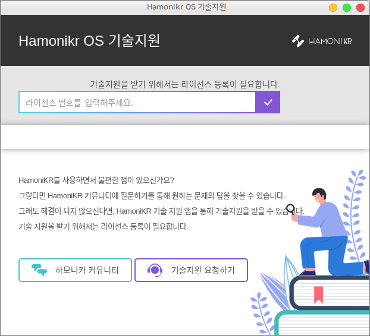

## hamonikr-support



- 유료 기술지원 서비스를 이용하는 고객용 프로그램

## 설치
```
sudo apt update
sudo apt install hamonikr-support
```

## 사용법
1) `프로그램 > 기술지원` 실행 후 계약 후 수신한 라이선스코드 입력
2) 기술지원 요청

## 이슈 또는 버그
 사용 중 문제를 발견하시면 sales@invesume.com 또는 https://invesume.com 에서 알려주세요.
